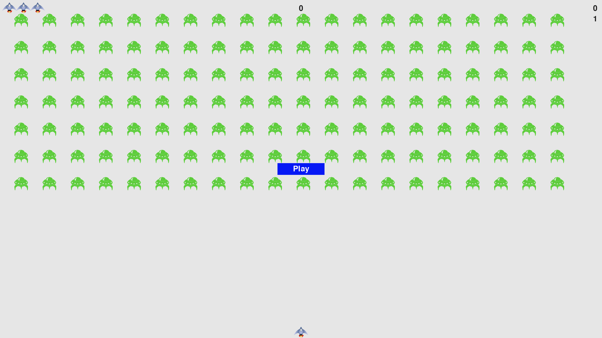

# Alien-Invasion
This enjoyable side-project is from Eric Matthes project-based programming book titled "Python Crash Course". 

The sole purpose of this project was to introduce me to another area of programming, unrelated to data science and machine learning. This project was exciting, and my friends and family enjoyed testing out my code. I hope you will too!

"Alien Invasion" is a Space Invaders-styled game. A Player begins with 4 lives (initial life + 3 more lives). The objective of the game is to shoot the alien fleet. The game will become progressively harder as the player continues to pass each round, and encounters the next fleet. Test your reflexes and your aim!

------------------------------------------------------------------------------------------------------------------------------

### Below is a screenshot/sneak peak at the code used throughout the project

------------------------------------------------------------------------------------------------------------------------------

### The Player will begin the game in an inactive instance. Here you will see how many lives you have(top left), the high score (middle of screen, will start at 0 every instance), the current score (top right), and the current level (beneath current score)

------------------------------------------------------------------------------------------------------------------------------

### Every alien you shoot down will reward you 50 points in level 1. The value of the points increases by x1.5 for every level afterward. 

------------------------------------------------------------------------------------------------------------------------------

### As you scale up the levels, the aliens, ship, and bullets will move faster and faster at a pace of x1.4 higher than the previous level.

------------------------------------------------------------------------------------------------------------------------------

### If the aliens reach the bottom of the screen, or if the aliens crash into your ship, the game will pause for 0.5 seconds to notify you that you failed. You will then lose one life, the fleet will respawn at the same level, and a new ship will reset at the bottom of the screen

